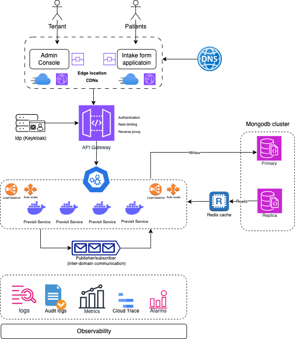

# Previsit Questionnaire App

## 📺 See in Action

[](https://drive.google.com/file/d/1YYDtVdH-ls4mmpA12z4u_KNnNy6fo0Ym/view?usp=sharing" type="video/mp4)


[Demo Video Link](https://drive.google.com/file/d/1YYDtVdH-ls4mmpA12z4u_KNnNy6fo0Ym/view?usp=sharing)

---

## ⚡ Quick Start

### 1. Prerequisites

Ensure you have the following installed:

- Node.js ≥ 20.x
- pnpm (required)
- Docker & Docker Compose
- make (for Unix-based systems)

> Optional: You can create a `.env` file from the provided template:
>
> ```bash
> cp sample_env.tpl .env
> ```
>
> _sample_env.tpl contents:_
> ```env
> MONGODB_URI=mongodb://mongo:27017/previsit-questionnaire
> MONGO_INITDB_DATABASE=previsit-questionnaire
> REDIS_URI=redis://redis:6379
> API_PORT=3000
> NEXT_PUBLIC_API_BASE_URL=http://previsit-api:3000/api
> NEXT_PUBLIC_CONSOLE_URL=http://localhost:4001
> ```

### 2. Using `run.sh` (recommended)

```bash
./run.sh
```

This script will:

- Launch MongoDB and Redis containers
- Install dependencies using `pnpm`
- Start all applications in development mode:
  - API: `http://localhost:3000`
  - Swagger: `http://localhost:3000/docs`
  - Admin Console: `http://localhost:4001`
  - Patient App: `http://localhost:4000`

### 3. Run with Makefile

- If not installed, install `make` and other relevant Unix build tools
- Create a `.env` file from the template:

  ```bash
  cp sample_env.tpl .env
  ```

- Run the Make command:

  ```bash
  make start-all
  ```

This will:
- Verify that the `.env` file exists
- Start the API, Admin Console, and Patient App in dev mode

### 4. Run in Dev Mode + MongoDB + Redis

- Install **MongoDB** if not already installed
- Install **Redis** if not already installed
- From the project root, install dependencies:

  ```bash
  pnpm install
  ```

- In separate terminals or tabs, run the following:

  ```bash
  cd previsit-api && pnpm start:dev
  ```

  ```bash
  cd previsit-console && pnpm start:dev
  ```

  ```bash
  cd previsit-app && pnpm start:dev
  ```

#### ✅ Verify:

- Swagger API Docs: [http://localhost:3000/docs](http://localhost:3000/docs)
- Admin Console: [http://localhost:4001](http://localhost:4001)
- Patient App: [http://localhost:4000](http://localhost:4000)

---

## 🚠 Tech Stack

- **Frontend:** Next.js (pnpm), TypeScript, TailwindCSS
- **Backend:** NestJS, TypeScript, Swagger, Redis
- **Database:** MongoDB
- **Message Queue:** (Pluggable) NATS / RabbitMQ / Kafka
- **Caching:** Redis
- **Infrastructure:** Docker, Docker Compose
- **CI/CD:** GitHub Actions / ArgoCD (planned)
- **Testing:** Jest, Cypress, Postman/Newman, K6

---

## 🛠️ Solution Design

### Architecture Diagram



#### ✅ What Was Implemented

- Dynamic EHR field mapping per provider (Athena, Allscripts, etc.)
- Admin panel to manage EHR mappings
- Patient app to collect responses based on questionnaire
- Multi-language support (English and Spanish)
- Tenant-aware API and caching with Redis
- Modular NestJS backend with MongoDB also support API versioning

#### 🔜 Pending Items
- Testing strategy
- Implementing service-to-service communication using pub-sub message queues. A good use case if updating a questionnaire status when an assessment is completed
- Admin UI for managing questionnaires
- Advanced user authentication and role-based access
- EHR delivery metrics and audit logs
- Batch uploads can be processed asynchronously via a message queue with a notification sent to the user showing detailed status report
- Sanitizing user inputs + validation in the frontend
- Sensitive user information can be encrypted as JWTs or algorithms like MD5, SHA-256 etc
- Use of standards like FHIR or HL7 for patient data

### 📊 Design Decisions

- **MongoDB** was chosen for flexibility in unstructured patient responses
- **Redis** provides fast cache lookup for resolved mappings and questionnaires
- **Event-driven architecture** via message queue allows decoupled EHR submission
- **Multi-language support** is centralized in i18n service for frontend/backend reuse
- **Modular EHR mapping strategy** supports future EHR integrations with minimal changes

### 🚀 CI/CD Considerations

- Use IaC tools like Terraform or CloudFormation to provision cloud resources
- Run application in Kubernetes with Helm + ArgoCD for deployment
- CI tools: CircleCI, Jenkins, GitHub Actions, or GitLab CI
- OIDC authentication for cloud infrastructure access

### 🧪 Testing Strategy Plan

#### Backend
- Unit tests with Jest + Mocks
- Smoke tests using Postman collections + Newman scripts
- Performance tests using K6
- Monitoring/telemetry with New Relic, Datadog

#### Frontend
- Unit tests with Jest + API mocks
- End-to-end tests with Cypress

---

## 🧹 Troubleshooting Guide

| Problem                          | Solution                                                                  |
|----------------------------------|---------------------------------------------------------------------------|
| MongoDB connection error         | Ensure MongoDB is running and accessible on `localhost:27017`.            |
| Redis not connecting             | Ensure Redis is running on `localhost:6379`.                              |
| API not reachable from frontend  | Check the `API_BASE_URL` value in `.env` or frontend configuration.       |
| CORS errors in frontend          | Confirm CORS is enabled in the NestJS backend.                            |
| Docker build fails               | Run `docker system prune -af` and rebuild with `--no-cache`.              |

---

## 🔗 Solution Repository

[GitHub Repo](https://github.com/akojimsg/previsit-questionnaire-app)
